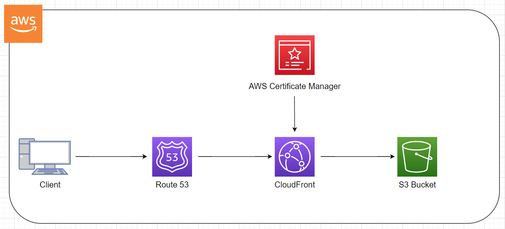

---
# 🚀 Static Website Hosting on AWS  
**Based on cloudisfree.com**  

## 📖 Overview  

This project walks through hosting a static HTML website on AWS using S3, Route 53, CloudFront, and ACM for SSL. I purchased a domain from Namecheap, imported it into AWS, and set everything up for a secure and performant static website.

## 🏗 Architecture  

A detailed architecture diagram is available in the project repo for reference.

## 🛠 Tools Used  

- **🌐 Domain Registration**: Namecheap  
- **📡 DNS Management**: AWS Route 53  
- **🪣 Static Hosting**: AWS S3  
- **🛡️ Content Delivery & Security**: AWS CloudFront, ACM (SSL)  
- **🔍 DNS Checks**: `nslookup`, `whatsmydns`  

## 🚀 Steps to Deploy  

### 1️⃣ Buy a Domain  
I grabbed a domain from Namecheap and later moved it into AWS for easier management.

### 2️⃣ Import Domain to AWS  
I set up the domain in Route 53 by creating a Hosted Zone and configuring the necessary DNS records.

### 3️⃣ Set Up Route 53 Hosted Zone  
- Created a Hosted Zone in Route 53.  
- Added DNS records to point to the S3 bucket and CloudFront.  
- Used `nslookup` and `whatsmydns` to verify DNS propagation.

### 4️⃣ Create S3 Buckets  
- Made two buckets:  
  - **Primary bucket**: Hosts the static website.  
  - **Redirect bucket**: Handles `www` domain variation.  
- Enabled static website hosting on the primary bucket.

### 5️⃣ Link Domain to S3 via Route 53  
Configured Route 53 Alias Records to point the domain to the S3 bucket.

### 6️⃣ Add SSL with ACM  
- Created an SSL certificate using AWS Certificate Manager (ACM).  
- Attached the certificate to the CloudFront distribution for HTTPS.

### 7️⃣ Set Up CloudFront  
- Created a CloudFront distribution to serve the site over HTTPS.  
- Mapped the domain to the CloudFront distribution for better performance and security.

## ✅ Testing  
- Verified DNS setup with `nslookup` and `whatsmydns`.  
- Tested the site to ensure proper redirects, HTTPS enforcement, and content loading.

## 📂 Repo  
The project repo includes the architecture diagram and configuration details.

## 🎯 Wrap-Up  
This project shows how to host a static website on AWS using S3, Route 53, CloudFront, and ACM. It’s a solid setup for a secure and fast static website.
